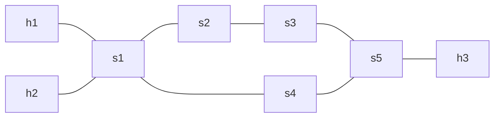

# Example 6: Multiprotocol Label-Switching
This example showcases how P4 can be used to implement MPLS-Switching utilizing the Network API from p4utils.
It shows how one could use P4 to implement a custom protocol and perform forwarding based on its header. In this case, a very simple form
of Multi Protocol Label Switching is performed. Packets can be given a Label and be routed a specific way based on table entries.

In this example, IPv4 traffic from ```h1``` to ```h3``` will always be routed over the shorter way using s4. This works by pushing a label on packets depending on the destination IP.

## Usage
It's assumed that you run this example in a VM, container or host that supports the necessary P4 tools. Otherwise please install all depencies as described for p4-boilerplate and p4environment (as described in the main README) or consider using p4-container. If you choose p4-container, be advised, that its support to run p4environment is limited, due to limitations for netem and openvswitch inside typical container environments.
```
cd p4-boilerplate/Example6-MPLS-Switching
sudo python3 network.py
```
This sets up the topology and drops you to a mininet console. You can ping ```h3``` from ```h1```:
```
mininet> h1 ping h3
```
You can verify by looking at the logs that indeed the packets were sent over ```s4```, according to a label that gets added to the packets.

## Topology


The topology consists of three hosts that are connected via switches as seen in the figure above.