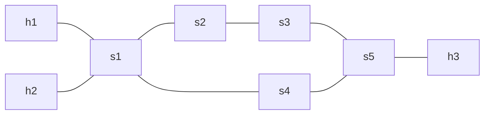

# Example 6: Multiprotocol Lable-Switching
This example showcases how P4 can be used to implement MPLS-Switching utilizing the Network API from p4utils.

## Usage

## Topology

The topology consists of three hosts that are connected via switches as seen in the figure above.